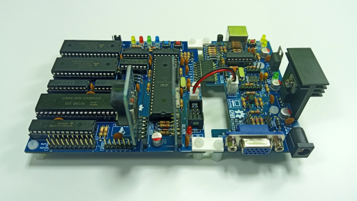

# CP/M-86 Kernel

## Synopsis

The goal of this project is to provide an out-of-the-box CP/M-86 1.1 kernel (BIOS, BDOS and CCP) that incorporates all existing patches plus the capacity to run on modern hardware and virtualization. A distribution of the CP/M-86 OS is also provided fully patched.

The distribution also packages digital research assembler tools and various basic environments.

- visual y2k support and tod replacement (https://github.com/tsupplis/cpm86-hacking)
- AT support
- resilience to bios limits for video display

This is a raw dump right now with a way to compile the kernel starting from dissassembled sources.
The compilation requires the (cross-development environment for CP/M-86)[https://github.com/tsupplis/cpm86-crossdev]

The CP/M-86 kernels (8088 and V20 Mixed 8080/8088 with CP/M-80 compatibility) for the V20 MBC are also produced. The sources of the bioses used are available at:
- https://hackaday.io/project/170924-v20-mbc-a-v20-8088-8080-cpu-homebrew-computer

The 3 kernels use the same BDOS and CCP components.

## Playing with CP/M-86

To test, the PCE emulator and cpmtools are needed. PCE can be found at http://www.hampa.ch/pce/. the floppy images released also work with qemu.

Alternatively, you can use the excellent V20 MBC available at:
- https://hackaday.io/project/170924-v20-mbc-a-v20-8088-8080-cpu-homebrew-computer
- https://shop.mcjohn.it/en/diy-kit

<p align="center">

</p>

- Patched CP/M-86 running in the PCE Emulator
<p align="center">

</p>

- CP/M-86 BIOS Setup 1.2
<p align="center">

</p>

- CP/M-86 Disk Maintenance 1.2
<p align="center">

</p>

## Distributions

A full 160K single face distribution is provided on 4 disks. The compiled cpm.sys file is also provided standalone:

- cpm86-160-1.img: bootable core CP/M-86
- cpm86-160-1-at.img: bootable core CP/M-86 with AT-compatible clock
- cpm86-160-2.img: assembler CP/M-86 tools
- cpm86-160-3.img: digital research dev tools
- cpm86-160-4.img: basic development (microsoft basic, personal basic, cbasic)

A full 1440 hd  distribution is provided on 1 disk (Using 144FEAT2 from Freek Heite):

- cpm86-1440-at.img: bootable core CP/M-86 + assembler CP/M-86 tools with AT-compatible clock + digital research dev tools + basic development (microsoft basic, personal

(Future) A full 320K double face distribution is provided on 2 disks:

- cpm86-320.img: bootable core CP/M-86, assembler CP/M-86 tools
- cpm86-320-at.img: bootable core CP/M-88 + assembler CP/M-86 tools with AT-compatible clock
- cpm86-320-dev.img: digital research dev tools + basic development (microsoft basic, personal basic, cbasic)


The kernels built and delivered standalone as part of the release are:
- cpm86.sys (ibm pc xt)
- cpmv20.sys (MBC V20, 8088 mode)
- cpm816.sys (MBC V20, mixed 8080/8088 mode with CP/M-80 compatibility)

The CP/M-86 OS contains the following commands are in the original distribution:
- asm86.cmd
- assign.cmd
- config.cmd
- ddt86.cmd
- help.cmd
- print.cmd
- function.cmd
- gencmd.cmd
- stat.cmd

The CP/M-86 OS is enhanced with the following patched or updated components:
- help.hlp (more complete content)
- dskmaint.cmd (updated from 1.0 to version 1.2)
- setup.cmd (updated from 1.0 to version 1.2)
- hdmaint.cmd (updated from 1.0 to version 1.1)
- ed.cmd (patched following dr recommendation)
- gendef.cmd (patched following dr recommendation)
- pip.cmd (patched following dr recommendation) 
- submit.cmd (patched following dr recommendation)
- mform.cmd (patched to avoid interactive question)
- tod.cmd (complete rewrite at https://github.com/tsupplis/cpm86-hacking)
- atinit.cmd (sync up RTC clock and bios if clock available, cf https://github.com/tsupplis/cpm86-hacking)

also the images produced from the blank image have a boot loader terminating with 55AA allowing emulators like qemu to load CP/M-86 properly. Beware, if the image is formatted using dskmaint.cmd, the signature will not be added. A small boot fix will be added later.

## cpmtools formats 

cpmtools 2.23 with libdsk is used.

cpmtools can be deployed with homebrew on mac of fetched at https://www.moria.de/~michael/cpmtools/.

the definitions used are:

```
# IBM CP/M-86
# setfdprm /dev/fd1 sect=8 dtr=1 hd ssize=512 tpi=48 head=1
diskdef ibmpc-514ss
   seclen 512
   tracks 40
   sectrk 8
   blocksize 1024
   maxdir 64
   skew 1
   boottrk 1
   os 2.2
   libdsk:format ibm160
end

# IBM CP/M-86
# setfdprm /dev/fd1 sect=8 dtr=1 hd ssize=512 tpi=48
diskdef ibmpc-514ds
   seclen 512
   tracks 80
   sectrk 8
   blocksize 2048
   maxdir 64
   skew 0
   boottrk 2
   os 2.2
   libdsk:format ibm320
end

# CP/M 86 on 1.44MB floppies
diskdef cpm86-144feat
  seclen 512
  tracks 160
  sectrk 18
  blocksize 4096
  maxdir 256
  skew 1
  boottrk 2
  os 3
  libdsk:format ibm1440
end
```

Currently the 320 format is not yet working. Using the format on a raw image results in the raw images being corrupted. the 2 other formats work perfectly. If you have a solution to that problem, please reach out.

## Pedigree

The main source for it is: http://www.cpm.z80.de

- Baseline: http://www.cpm.z80.de/download/cpm86src.zip
- Baseline: http://www.cpm.z80.de/download/cpmdev.zip
- Patching Source: http://www.cpm.z80.de/download/cpm86ann.zip
- Patching Source: http://www.cpm.z80.de/download/cpm86bug.zip
- 144FEAT2 from Freek Heite

To be continued...
