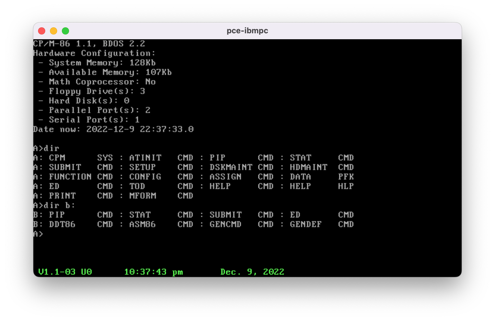
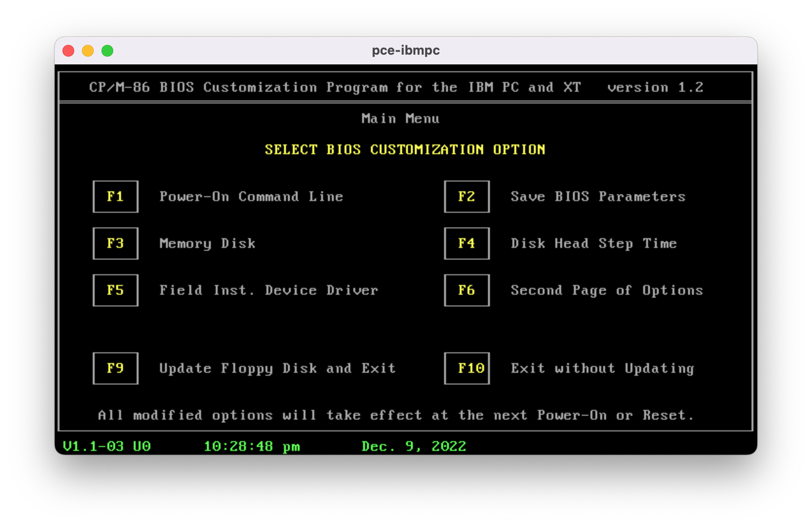
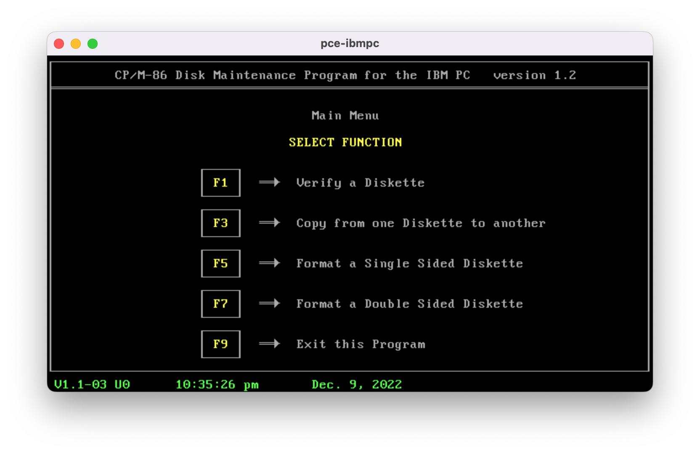

# CP/M-86 Kernel

## Synopsis

The goal of this project is to provide an out-of-the-box CP/M-86 1.1 kernel (BIOS, BDOS and CCP) that incorporates all existing patches plus the capacity to run on modern hardware and virtualization. A distribution of CP/M-86 is also provided fully patched.

- visual y2k support and tod replacement (https://github.com/tsupplis/cpm86-hacking)
- AT support
- resilience to bios limits for video display

This is a raw dump right now with a way to compile the kernel starting from dissassembled sources.
The compilation requires the (cross-development environment for CP/M-86)[https://github.com/tsupplis/cpm86-crossdev]

## Playing with CP/M-86

To test, the PCE emulator and cpmtools are needed. PCE can be found at http://www.hampa.ch/pce/.

- Patched CP/M-86 running in the PCE Emulator

- CP/M-86 BIOS Setup 1.2

- CP/M-86 Disk Maintenance 1.2

## Distribution

A full 160K single phase distribution is provided on 2 disks. The compiled cpm.sys file is also provided standalone.

The following commands are in the original distribution:
- asm86.cmd
- assign.cmd
- config.cmd
- ddt86.cmd
- help.cmd
- print.cmd
- function.cmd
- gencmd.cmd
- stat.cmd

The distribution is provided with the following patched or updated components:
- help.hlp (more complete content)
- dskmaint.cmd (updated from 1.0 to version 1.2)
- setup.cmd (updated from 1.0 to version 1.2)
- hdmaint.cmd (updated from 1.0 to version 1.1)
- ed.cmd (patched following dr recommendation)
- gendef.cmd (patched following dr recommendation)
- pip.cmd (patched following dr recommendation) 
- submit.cmd (patched following dr recommendation)
- mform.cmd (patched to avoid interactive question)
- tod.cmd (complete rewrite at https://github.com/tsupplis/cpm86-hacking)
- atinit.cmd (sync up RTC clock and bios if clock available, cf https://github.com/tsupplis/cpm86-hacking)

## Pedigree

The main source for it is: http://www.cpm.z80.de

- Baseline: http://www.cpm.z80.de/download/cpm86src.zip
- Baseline: http://www.cpm.z80.de/download/cpmdev.zip
- Patching Source: http://www.cpm.z80.de/download/cpm86ann.zip
- Patching Source: http://www.cpm.z80.de/download/cpm86bug.zip

To be continued...
