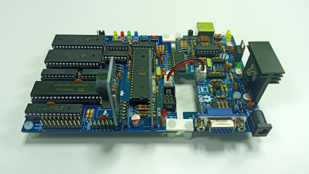
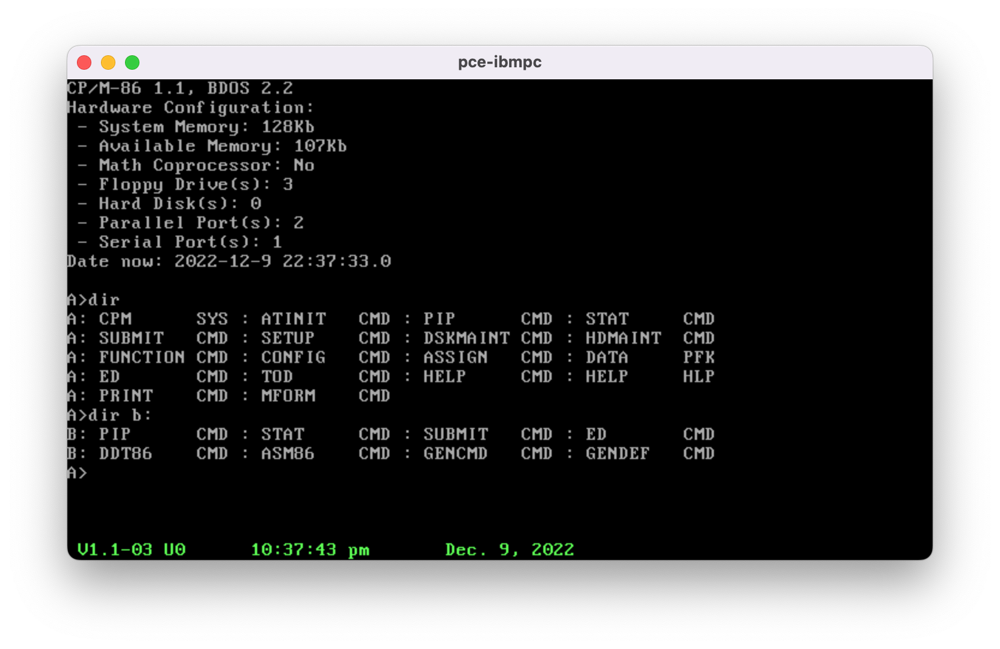
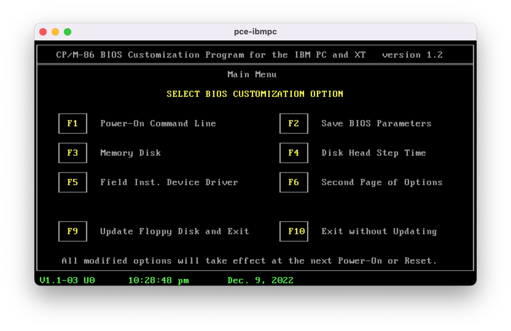
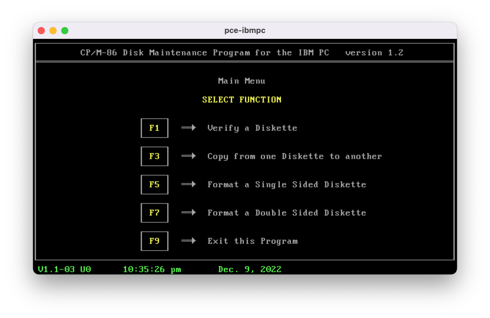

# CP/M-86 Kernel and Base Tools

## Synopsis

The goal of this project is to provide an out-of-the-box CP/M-86 1.1 kernel (BIOS, BDOS and CCP) that incorporates all existing patches plus the capacity to run on modern hardware and virtualization. A distribution of the CP/M-86 OS is also provided fully patched.

The distribution also packages digital research assembler tools and various basic environments.

- visual y2k support and tod replacement (https://github.com/tsupplis/cpm86-hacking). The code is available in this project.
- AT support
- resilience to bios limits for video display

This is a raw dump right now with a way to compile the kernel starting from dissassembled sources.
The compilation requires the (cross-development environment for CP/M-86)[https://github.com/tsupplis/cpm86-crossdev]

The CP/M-86 kernels (8088 and V20 Mixed 8080/8088 with CP/M-80 compatibility) for the V20 MBC are also produced. The sources of the bioses used are available at:
- https://hackaday.io/project/170924-v20-mbc-a-v20-8088-8080-cpu-homebrew-computer

The 3 kernels use the same BDOS and CCP components.

## Playing with CP/M-86

To test, the PCE emulator and cpmtools are needed. PCE can be found at http://www.hampa.ch/pce/. the floppy images released also work with qemu.

Alternatively, you can use the excellent V20 MBC available at:
- https://hackaday.io/project/170924-v20-mbc-a-v20-8088-8080-cpu-homebrew-computer
- https://shop.mcjohn.it/en/diy-kit

<p align="center">

</p>

- Patched CP/M-86 running in the PCE Emulator
<p align="center">

</p>

- CP/M-86 BIOS Setup 1.2
<p align="center">

</p>

- CP/M-86 Disk Maintenance 1.2
<p align="center">

</p>

## Distributions

The repository holds three separate bodies of work:

| | What | Where |
| --- | --- | --- |
| 1 | Three parallel source sets of the PC CP/M-86 1.1 kernel | repository root |
| 2 | The original tool binaries, patched and updated | `base/`, `dev/`, `extra/` |
| 3 | Reconstruction of the tools from source | `commands/` |

### 1. Kernel source sets

The kernel was recovered by disassembly, so the sources are kept in three
parallel sets that can be diffed and rebuilt against each other. `ccp` and
`bdos` are shared by all PC and V20 kernels; only the BIOS differs.

| Set | Sources | Kernel | Intent |
| --- | --- | --- | --- |
| `*org.*` | `ccporg.a86` `bdosorg.a86` `pcbioorg.a86` | `cpmorg.sys` | Original patched release. Frozen reference, never edited. |
| `*.*` | `ccp.a86` `bdos.a86` `pcbios.a86` | `cpm.sys` | Byte-identical to `*org.*`; labelling, commenting and documentation in progress. |
| `*exp.*` | `ccpexp.a86` `bdosexp.a86` `pcbioexp.a86` | `cpmexp.sys` | Experimental cleaned-up and optimised variant. |

`make check` asserts that `cpm.sys` and `cpmorg.sys` are binary-identical, so
the annotation work cannot silently change behaviour.

Two further BIOSes target the V20 MBC:

| Kernel | Target |
| --- | --- |
| `cpmv20.sys` | MBC V20, 8088 mode (`mbcv20.a86`) |
| `cpm816.sys` | MBC V20, mixed 8080/8088 mode with CP/M-80 compatibility (`mbc816.a86`) |

### Disk images

Four sets are produced. The 160K set is the reference layout; the others repack
the same material to fit the media, except the experimental set which swaps in
the `commands/` reconstruction.
**160K single sided — 4 disks**

| Image | Contents |
| --- | --- |
| `cpm86-160-1.img` | Bootable core CP/M-86 |
| `cpm86-160-1-at.img` | Bootable core, AT-compatible clock |
| `cpm86-160-2.img` | Assembler CP/M-86 tools |
| `cpm86-160-3.img` | Digital Research dev tools |
| `cpm86-160-4.img` | BASIC development |

**320K double sided — 3 disks**

| Image | Contents |
| --- | --- |
| `cpm86-320.img` | Bootable core + assembler tools |
| `cpm86-320-at.img` | Bootable core + assembler tools, AT-compatible clock |
| `cpm86-320-dev.img` | Digital Research dev tools + BASIC development |

**720K / 1.44M via the "1.44 MB Feature" — 2 disks**

| Image | Contents |
| --- | --- |
| `cpm86-720-at.img` | Everything above, AT-compatible clock |
| `cpm86-1440-at.img` | Same content on 1.44M media |

Both use Freek Heite's 1.44 MB Feature, rebuilt from source under `extra/`.
They carry identical content — the whole `base/` command set plus the `dev/`
toolchain — and are produced by the same Makefile recipe, parameterised only by
geometry. 720K leaves about 100 of its 355 blocks free.

**Experimental — 4 disks**

| Image | Contents |
| --- | --- |
| `cpm86-exp-160-1.img` | Experimental kernel with the `commands/` reconstruction in place of `base/` |
| `cpm86-exp-160-1-at.img` | Same, AT-compatible clock |
| `cpm86-exp-720-at.img` | Experimental kernel plus the full reconstruction and the dev toolchain |
| `cpm86-exp-1440-at.img` | Same content on 1.44M media |

The experimental images boot `cpmexp.sys` and carry the rebuilt tools rather
than the `base/` binaries, so a single boot exercises both halves of the work.
The 160K pair ships `ed`, `help`, `pip`, `stat`, `submit` and `tod`; the feature
images add `asm86`, `ddt86` and `gencmd` for the complete set.

They also carry their own build of the feature: `cpmexp.sys` moves the CCP and
BDOS stack switches that the loader patches at boot, so the stock `144BLDR2`
would fail its byte checks against it. See the `expkrnl` block in
`extra/144pat2.asm`.

PCE helper scripts exist per variant — `./cpm86`, `./cpm86-320`, `./cpm86-720`,
`./cpm86-1440`, `./cpm86-exp`, `./cpm86-exp-720`, `./cpm86-exp-1440`. `make
test`, `make test-320` and `make test-exp` are shortcuts for the common ones.

The 160K images carry a boot loader terminating with `55AA`, which lets qemu
load CP/M-86 properly. Beware: formatting with `dskmaint.cmd` does not add the
signature.

The other formats cannot carry it, because byte `01FFh` of the boot sector is
already a format byte and `AAh` would collide with it:

| Format | `01FFh` | Meaning |
| --- | --- | --- |
| 160K | `AAh` | free — second half of the `55AA` signature |
| 320K | `01h` | selects 2K allocation blocks (`DPBK2`); any other value gives 1K (`DPBK1`) |
| 720K / 1.44M | `48h` / `90h` | `cpmedia` media byte written by the feature's boot sector |

The 320K test lives in the second-stage loader, which reads the boot sector
still resident at `0000:7C00`:

```asm
mov ax,0x400               ; default allocation block = 1024  (160K)
cmp byte [es:0x7dff],0x1   ; boot sector byte 01FFh == 1 ?
jnz keep
mov ax,0x800               ; yes -> allocation block = 2048  (320K)
```

Stamping `55AA` on a 320K image therefore makes the loader read a 2K-block
filesystem as if it used 1K blocks; it finds `E5` fill instead of `CPM.SYS` and
hangs after printing one dot.

### 2. Tool binaries

`base/` holds the CP/M-86 command set. Some tools ship untouched, others are
patched or replaced.

| State | Tools |
| --- | --- |
| Original | `asm86` `assign` `config` `ddt86` `function` `gencmd` `help` `print` `stat` |
| Updated release | `dskmaint` (1.0 → 1.2), `setup` (1.0 → 1.2), `hdmaint` (1.0 → 1.1), `help.hlp` (fuller content) |
| Patched per DR recommendation | `ed` `gendef` `pip` `submit` |
| Locally patched | `mform` (interactive prompt removed) |
| Added | `atinit` (RTC sync), from [cpm86-hacking](https://github.com/tsupplis/cpm86-hacking) |

`tod` is deliberately absent from `base/`: the original is superseded by the
CP/M-86-native rewrite, so every image takes it from `commands/tod`.

`extra/` holds Freek Heite's "1.44 MB Feature", which adds 720K, 1.2M and 1.44M
diskette support to CP/M-86 1.1. It is built from source by `make -C extra`
using MASM 5.10 and LINK 5.13 under DOS emulation, replacing the original
`144make2.bat`:

| Output | Role |
| --- | --- |
| `144bldr2.cmd` | Secondary loader; patches the kernel in memory at boot |
| `144pat2.cmd` | Applies the same patches to an already-running system |
| `144prep2.cmd` | Prepares a diskette (boot sector + loader appended) |
| `144patx.cmd` `144prepx.cmd` `144bldrx.cmd` | The `expkrnl` builds, for `cpmexp.sys` |

The rebuilt `144pat2.cmd` is byte-identical to the binary originally shipped
here, so the toolchain reproduces upstream exactly.

`dev/` holds the Digital Research and Microsoft toolchains, as shipped and
unmodified:

| Tool | Product | Version | Date | Vendor |
| --- | --- | --- | --- | --- |
| `rasm86.cmd` | RASM-86 Relocating Assembler | 1.2 | 1982-1983 | Digital Research |
| `link86.cmd` | LINK86 Linkage Editor | 2.02 | 02/Feb/87 | Digital Research |
| `lib86.cmd` | LIB-86 Library Manager (CDOS 86) | 1.3 | 2/23/86 | Digital Research |
| `xref86.cmd` | XREF-86 Cross Reference | 1.1 | 1982-1983 | Digital Research |
| `sid86.cmd` | SID-86 with 286 Disassembler | 2.4 | 07 May 1985 | Digital Research |
| `cbas86.cmd` | CBAS86 CBASIC Compiler | 1.4 | 1981-1983 | Digital Research |
| `crun86.cmd` | CRUN86 CBASIC Runtime | 1.4 | 1981-1983 | Digital Research |
| `pbasic.cmd` | Personal BASIC | 1.2 | 1983-1985 | Digital Research |
| `mbasic86.cmd` | BASIC-86 (CP/M-86 patched) | Rev. 5.22 | 5-Mar-82 | Microsoft |

### 3. Tool reconstruction from source

`commands/` rebuilds the tools from the surviving PL/M and ASM86 sources. Those
sources are Concurrent CP/M-86 3.1 vintage and assume BDOS 3.x, while this
kernel reports BDOS 2.2 with `BH=0`. Each tool was therefore audited for version
guards and for calls into BDOS functions this kernel does not implement.

| Tool | Outcome |
| --- | --- |
| `asm86` `gencmd` | CCP/M-86 3.1 sources. Compatible with CP/M-86 |
| `ddt86` `ed` `help` | CCP/M-86 3.1 sources. Compatible with CP/M-86 |
| `pip` | Reconstructed from CCP/M-86 3.1 sources |
| `stat` | Reconstructed from CP/M-80 2.2 sources |
| `submit` | Reconstructed from CP/M-80 2.2 sources |
| `tod` | Superseded by the CP/M-86-native rewrite; the only tool with no `base/` binary |

`make commands` builds the whole set. The root build depends on it, since `tod`
is needed by every image and the rest by the experimental ones.

## cpmtools formats 

cpmtools 2.23 with libdsk is used.

cpmtools can be deployed with homebrew on mac of fetched at https://www.moria.de/~michael/cpmtools/.

All five formats live in the `diskdefs` file at the root of this repository.
cpmtools reads `./diskdefs` in preference to the system-wide file and does
**not** merge the two, so run the `cpm*` tools from the repo root and expect
every format used here to be listed there.

| Format | Geometry | Block | Dir | Reserved |
| --- | --- | --- | --- | --- |
| `ibmpc-514ss` | 40 × 8 × 512 (160K SS) | 1K | 64 | 1 track |
| `cpm86-320` | 80 × 8 × 512 (320K DS) | 2K | 64 | 1 track |
| `cpm86-720feat` | 160 × 9 × 512 (720K) | 2K | 256 | 2 tracks |
| `cpm86-144feat` | 160 × 18 × 512 (1.44M) | 4K | 256 | 2 tracks |
| `cpm86-xt-hd` | 272 × 63 × 512 (8M partition) | 4K | 2048 | 16 tracks |

All five use `os 2.2`, matching the kernel's BDOS level. That matters for the
feature formats: with `os 3`, `mkfs.cpm` writes an `UNLABELED` CP/M Plus disk
label into the directory, which this BDOS cannot use and which permanently
occupies a directory slot.

The two feature definitions come straight from the DPBs in
[extra/144tech.md](extra/144tech.md) — for 720K, SPT=36, BSH=4/BLM=15, DSM=354,
DRM=255, OFF=2, i.e. 355 blocks of 2K with an 8K directory starting on track 2.

`cpm86-xt-hd` is different in kind: a hard disk's parameters are not compiled
into the BIOS. `CHKHDDPAR` scans the MBR for a partition of type `DBh`, reads
that partition's cylinder / head 0 / **sector 4**, checks that the 256 words of
that sector sum to zero, and lifts the DPB out of the Digital Research disk
label at offset 41. The label on the IBM XT image reads SPT=252 (63 physical
sectors), BSH=5/BLM=31/EXM=1, DSM=2015, DRM=2047, AL0=AL1=`FFh`, CKS=`8000h`
(bit 15 = fixed media), OFF=16.

CP/M tracks are counted from LBA 0 of the *drive*, not from the partition, so
OFF=16 spans the whole of cylinder 0 (16 heads × 63) and the directory begins
at LBA 1008. `boottrk 16` therefore stands in for a partition offset, and the
definition applies to the raw disk image. Another drive will carry a different
label, so re-read it rather than reusing these numbers.

A blank feature diskette is only a boot sector plus an erased directory, so
`base-720-at.img` is generated rather than checked in:

```sh
mkfs.cpm -f cpm86-720feat -b <boot-sector> base-720-at.img
```

`mkfs.cpm` does not size the image, so it has to be pre-allocated to 737280
bytes of `0xE5` first. The boot sector is `extra/144boot2.bin` with its last
byte — the media byte, `cpmedia` in `144boot2.asm` — set to 72 for 720K rather
than 144. Note this omits the DOS FAT camouflage and the `CP/M-86.720`
space-claiming file that a real `144PREP` run writes; those only stop DOS and
stock CP/M-86 writing to the disk, and nothing in the boot path reads them.
Physical media still needs a DOS low-level format before `144PREP`.

### The 320K format (solved)

The stock `ibmpc-514ds` definition shipped with cpmtools corrupts 320K raw
images. The cause is in the BIOS, not in cpmtools.

`SETUP_INTREG` in `pcbios.a86` maps a CP/M track to a physical cylinder/head
like this:

```asm
mov	ch,al        ; cylinder = CP/M track
cmp	ch,28h       ; below 40 ?
jb	SETUP_INTREG_FIN
mov	ch,4Fh       ; 79
sub	ch,al        ; cylinder = 79 - track
mov	dh,01h       ; head 1
```

So CP/M tracks 0-39 are cylinders 0-39 on head 0, and CP/M tracks 40-79 are
cylinders **39 down to 0** on head 1. Side 1 is laid down in reverse cylinder
order. A raw image is a plain CHS dump (cyl0/h0, cyl0/h1, cyl1/h0, ...), so the
CP/M track order and the image order do not match. cpmtools has no diskdef
syntax to express that, and `ibmpc-514ds` assumes a linear layout.

`ibmpc-514ds` also disagrees with the BIOS disk parameter block `DPBK2`
(SPT=32, BSH=4/BLM=15/EXM=1, DSM=157, DRM=63, **OFF=1**): `boottrk 2` on a
linear image yields 156 blocks instead of 158.

The reason the corruption looks so odd is that the directory survives. With
OFF=1 the directory is block 0 at CP/M track 1, which is cylinder 1 head 0, at
byte 8192 of the image. `ibmpc-514ds` with `boottrk 2` also lands on byte 8192.
Block 1 coincides too. Everything from block 2 onward does not, so `cpmls`
prints a perfect directory while every file reads back as garbage.

The 160K format is unaffected because it is single sided, so the reverse-order
branch never runs.

The fix is the corrected `cpm86-320` definition described above, plus
`tools/cpm86twist.py` to convert between physical CHS order and CP/M logical
track order:

```
python3 tools/cpm86twist.py untwist disk.img work.img
cpmcp -f cpm86-320 work.img base/pip.cmd 0:PIP.CMD
python3 tools/cpm86twist.py twist work.img disk.img
```

The `Makefile` targets for `cpm86-320.img`, `cpm86-320-at.img` and
`cpm86-320-dev.img` do this automatically.

## Pedigree

The main source for it is: http://www.cpm.z80.de

- Baseline: http://www.cpm.z80.de/download/cpm86src.zip
- Baseline: http://www.cpm.z80.de/download/cpmdev.zip
- Patching Source: http://www.cpm.z80.de/download/cpm86ann.zip
- Patching Source: http://www.cpm.z80.de/download/cpm86bug.zip
- 144FEAT2 from Freek Heite

To be continued...
