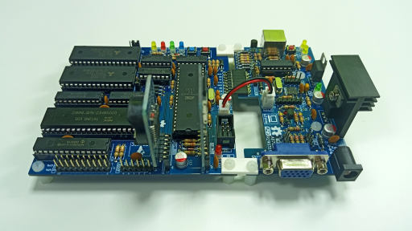
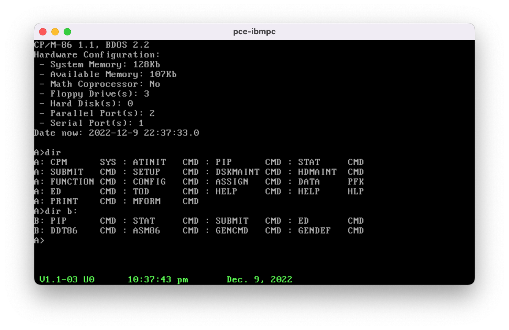
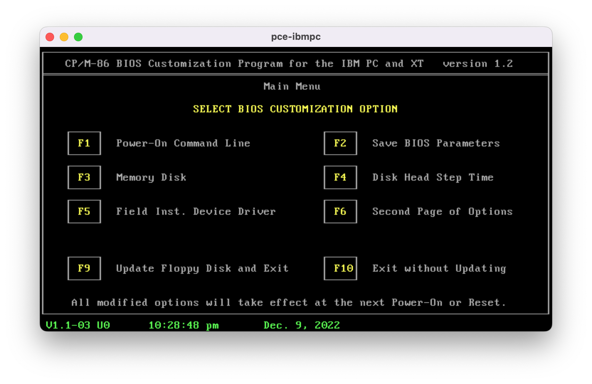
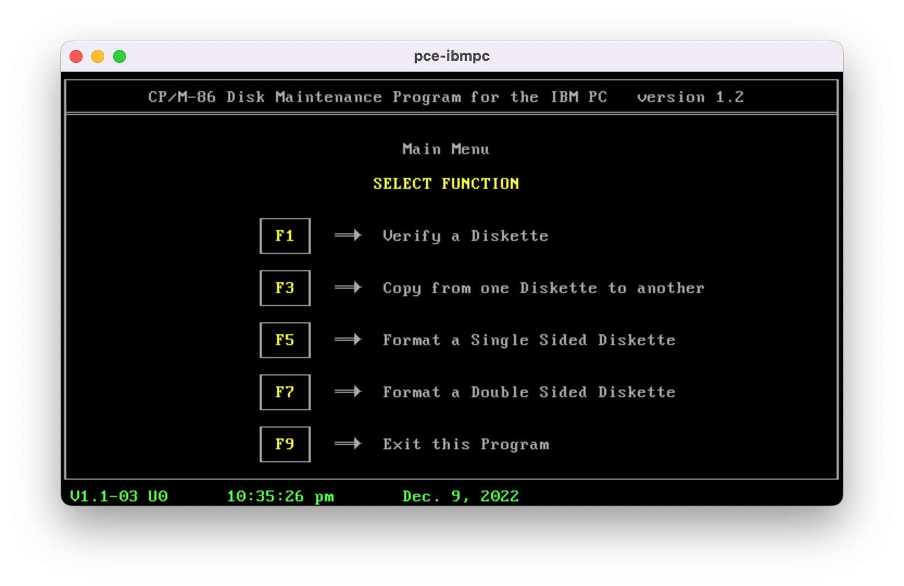

# CP/M-86 Kernel and Base Tools

## Synopsis

CP/M-86 1.1 kernel (BIOS, BDOS, CCP) and standard command set for IBM PC XT, emulators, and the V20 MBC, fully patched and buildable from source. Three parallel kernel source sets are kept: a frozen reference, an annotated working copy, and an experimental build. All standard commands are being rebuilt from original PL/M and assembler sources; original and patched binaries, the Digital Research and Microsoft dev toolchains, and `asm80`/`hexcom` for mixed 8080/8086 environments are also included.

Build requires [cpm86-crossdev](https://github.com/tsupplis/cpm86-crossdev).

## Distributions

| # | What | Where |
| --- | --- | --- |
| 1 | Kernel source sets | repository root |
| 2 | Original/patched tool binaries and dev toolchains | `base/`, `dev/`, `extra/` |
| 3 | Tool reconstruction from source | `commands/` |

### 1. Kernel source sets

The kernel was recovered by disassembly. Three parallel PC sets allow diffing and rebuilding against each other; `ccp` and `bdos` are shared by all kernels, only the BIOS differs.

| Set | Sources | Kernel | Intent |
| --- | --- | --- | --- |
| `*org.*` | `ccporg.a86` `bdosorg.a86` `pcbioorg.a86` | `cpmorg.sys` | Frozen patched reference — never edited |
| `*.*` | `ccp.a86` `bdos.a86` `pcbios.a86` | `cpm.sys` | Byte-identical to `*org.*`; labelling and commenting in progress |
| `*exp.*` | `ccpexp.a86` `bdosexp.a86` `pcbioexp.a86` | `cpmexp.sys` | Experimental cleaned-up variant |

`make check` asserts that `cpm.sys` and `cpmorg.sys` are binary-identical, so annotation work cannot silently change behaviour.

A fourth PC kernel with the 8080-model flag set (CP/M-80 binary compatibility on PC XT) is built under `private/` as `cpm86.sys`.

Two further BIOSes target the V20 MBC, sharing the same CCP and BDOS:

| Kernel | Target |
| --- | --- |
| `cpmv20.sys` | V20 MBC, 8088 mode (`mbcv20.a86`) |
| `cpm816.sys` | V20 MBC, mixed 8080/8088 mode with CP/M-80 compatibility (`mbc816.a86`) |

### 2. Tools

The CP/M-86 command set is available both as patched/original binaries (`base/`) and as reconstructed source builds (`commands/`). The table below shows the status of each tool in both dimensions.

Sources are Concurrent CP/M-86 3.1 vintage and assume BDOS 3.x; this kernel reports BDOS 2.2 with `BH=0`. Each tool was audited for version guards and for calls into BDOS functions not present in this kernel.

| Tool | Binary (`base/`) | Source (`commands/`) |
| --- | --- | --- |
| `asm86` | Original | CCP/M-86 3.1 |
| `assign` | Original | Reverse engineering |
| `config` | Original | Reverse engineering |
| `ddt86` | Original | CCP/M-86 3.1 |
| `dskmaint` | Updated 1.0→1.2 | Reverse engineering |
| `ed` | Patched (DR rec.) | CCP/M-86 3.1 |
| `function` | Original | Reverse engineering |
| `gencmd` | Original | CCP/M-86 3.1 |
| `gendef` | Patched (DR rec.) | — |
| `hdmaint` | Updated 1.0→1.1 | — |
| `help` | Original | CCP/M-86 3.1 |
| `help.hlp` | Updated (fuller content) | CCP/M-86 3.1 |
| `mform` | Patched (prompt removed) | Reverse engineering |
| `pip` | Patched (DR rec.) | CCP/M-86 3.1 |
| `print` | Original | — |
| `setup` | Updated 1.0→1.2 | Reverse engineering, WIP |
| `stat` | Original | CP/M-80 2.2 |
| `submit`  | Patched (DR rec.) | CP/M-80 2.2 |
| `tod` | — (superseded) | CP/M-86-native rewrite |
| `atinit` | Imported from [cpm86-hacking](https://github.com/tsupplis/cpm86-hacking) | — |
| `asm80` | — | DR CP/M-80 sources (1976–1978) |
| `hexcom` | — | DR HEXCOM 3.00 reimplementation |
> A clean-room reimplementation of `submit` (`msub`) with a visual and configurable menu system for submit orchestration is available at [cpm86-menu](https://github.com/tsupplis/cpm86-menu).

`make commands` builds the full source set. `tod` has no `base/` binary and is required by every image; the rest of the source-built tools are used by the experimental images.

#### Mixed 8080/8086 support

`asm80` and `hexcom` support mixed 8080/8086 environments such as the V20 MBC (`cpm816.sys`) and the experimental `cpm86.sys` PC kernel.

- `asm80`: the original Digital Research CP/M-80 assembler source (copyright 1976–1978) converted and unified for the CP/M-86 model. 
- `hexcom`: portable ANSI C reimplementation of DR HEXCOM 3.00, imported from [tpzasm](https://github.com/johnsonjh/tpzasm) and validated against the original binary.

As the mixed kernel is still in the work, you can meanwhile use the z80 and vcpm emulators for CP/M-86 available at [cpm86-ports](https://github.com/tsupplis/cpm86-ports) 

Together they form a minimum native 8080 development chain on CP/M-86.

#### 1.44 MB Feature

Freek Heite's "1.44 MB Feature" adds 720K, 1.2M and 1.44M diskette support. Built from source by `make -C extra` using MASM 5.10 and LINK 5.13 under DOS emulation. The rebuilt `144pat2.cmd` is byte-identical to the binary originally shipped here.

| Output | Role |
| --- | --- |
| `144bldr2.cmd` | Secondary loader; patches the kernel in memory at boot |
| `144pat2.cmd` | Applies the same patches to an already-running system |
| `144prep2.cmd` | Prepares a diskette (boot sector + loader appended) |

#### Digital Research and Microsoft toolchains

Shipped unmodified.

| Tool | Product | Version | Vendor |
| --- | --- | --- | --- |
| `rasm86.cmd` | RASM-86 Relocating Assembler | 1.2 | Digital Research |
| `link86.cmd` | LINK86 Linkage Editor | 2.02 | Digital Research |
| `lib86.cmd` | LIB-86 Library Manager | 1.3 | Digital Research |
| `xref86.cmd` | XREF-86 Cross Reference | 1.1 | Digital Research |
| `sid86.cmd` | SID-86 with 286 Disassembler | 2.4 | Digital Research |
| `cbas86.cmd` | CBAS86 CBASIC Compiler | 1.4 | Digital Research |
| `crun86.cmd` | CRUN86 CBASIC Runtime | 1.4 | Digital Research |
| `pbasic.cmd` | Personal BASIC | 1.2 | Digital Research |
| `mbasic86.cmd` | BASIC-86 (Imported from [cpm86-msbasic](https://github.com/tsupplis/cpm86-msbasic)) | Rev. 5.50 | Microsoft |

### Disk images

Four sets are produced. The 160K set is the reference layout; the others repack the same material for larger media. The experimental set boots `cpmexp.sys` and replaces `base/` binaries with source-rebuilt tools.

**160K single sided: 4 disks**

| Image | Contents |
| --- | --- |
| `cpm86-160-1.img` | Bootable core CP/M-86 |
| `cpm86-160-1-at.img` | Bootable core, AT-compatible clock |
| `cpm86-160-2.img` | CP/M-86 assembler tools |
| `cpm86-160-3.img` | Digital Research dev tools |
| `cpm86-160-4.img` | BASIC development |

**320K double sided: 3 disks**

| Image | Contents |
| --- | --- |
| `cpm86-320.img` | Bootable core + assembler tools |
| `cpm86-320-at.img` | Bootable core + assembler tools, AT-compatible clock |
| `cpm86-320-dev.img` | Digital Research dev tools + BASIC development |

**720K / 1.44M via the "1.44 MB Feature" — 2 disks**

| Image | Contents |
| --- | --- |
| `cpm86-720-at.img` | Full command set + dev toolchain, AT-compatible clock |
| `cpm86-1440-at.img` | Same content on 1.44M media |

**Experimental: 4 disks**

| Image | Contents |
| --- | --- |
| `cpm86-exp-160-1.img` | `cpmexp.sys` + source-rebuilt core tools |
| `cpm86-exp-160-1-at.img` | Same, AT-compatible clock |
| `cpm86-exp-720-at.img` | `cpmexp.sys` + full reconstruction + dev toolchain |
| `cpm86-exp-1440-at.img` | Same content on 1.44M media |

The experimental 160K pair ships `ed`, `help`, `pip`, `stat`, `submit` and `tod`; the feature images add `asm86`, `ddt86` and `gencmd`. Feature programs auto-detect `cpmexp.sys` vs stock `cpm.sys` at runtime (see `extra/144feat.inc`).

PCE helper scripts: `./cpm86`, `./cpm86-320`, `./cpm86-720`, `./cpm86-1440`, `./cpm86-exp`, `./cpm86-exp-720`, `./cpm86-exp-1440`. `make test`, `make test-320` and `make test-exp` are shortcuts for the common ones.

The 160K images carry a `55AA` boot signature for qemu compatibility. The other formats cannot: byte `01FFh` of their boot sector is already used (`01h` = 2K alloc blocks for 320K; `48h`/`90h` = `cpmedia` byte for feature formats). Stamping `55AA` on a 320K image causes the loader to misread the block size and hang.

## cpmtools formats

cpmtools 2.23 with libdsk, install via Homebrew or from https://www.moria.de/~michael/cpmtools/. Run `cpm*` tools from the repo root; cpmtools reads `./diskdefs` in preference to the system-wide file and does **not** merge the two. All five formats use `os 2.2` to match the kernel's BDOS level (using `os 3` causes `mkfs.cpm` to write an `UNLABELED` CP/M Plus label that permanently occupies a directory slot).

| Format | Geometry | Block | Dir | Reserved |
| --- | --- | --- | --- | --- |
| `ibmpc-514ss` | 40 × 8 × 512 (160K SS) | 1K | 64 | 1 track |
| `cpm86-320` | 80 × 8 × 512 (320K DS) | 2K | 64 | 1 track |
| `cpm86-720feat` | 160 × 9 × 512 (720K) | 2K | 256 | 2 tracks |
| `cpm86-144feat` | 160 × 18 × 512 (1.44M) | 4K | 256 | 2 tracks |
| `cpm86-xt-hd` | 272 × 63 × 512 (8M partition) | 4K | 2048 | 16 tracks |

Feature format DPBs are documented in [extra/144tech.md](extra/144tech.md). Hard-disk parameters for `cpm86-xt-hd` are not compiled into the BIOS. `CHKHDDPAR` reads them at runtime from the DR disk label embedded in the partition; re-read for a different drive rather than reusing the values above.

**Note on the 320K format:** the stock `ibmpc-514ds` definition shipped with cpmtools corrupts 320K raw images. The CP/M-86 BIOS lays out head 1 in reverse cylinder order (tracks 40–79 → cylinders 39 down to 0), which no cpmtools `diskdef` can express. The corrected `cpm86-320` definition plus `tools/cpm86twist.py` handles the reordering; the `Makefile` targets for `cpm86-320*.img` apply it automatically.

## Playing with CP/M-86

Testing requires the [PCE emulator](http://www.hampa.ch/pce/) and cpmtools (see above). Floppy images also work with qemu. Alternatively, use the [V20 MBC](https://hackaday.io/project/170924-v20-mbc-a-v20-8088-8080-cpu-homebrew-computer) hardware ([shop](https://shop.mcjohn.it/en/diy-kit)).

 V20 MBC hardware &nbsp;·&nbsp; CP/M-86 running in PCE 

 BIOS Setup 1.2 &nbsp;·&nbsp; Disk Maintenance 1.2

---

## Companion projects

| Project | Description |
| --- | --- |
| [cpm86-kernel](https://github.com/tsupplis/cpm86-kernel) | CP/M-86 1.1 distribution rebuilt from patched and reconstituted sources |
| [ccpm86-y2k](https://github.com/tsupplis/ccpm86-y2k) | CCP/M-86 3.1 distribution rebuilt from patched and reconstituted sources |
| [cpm86-crossdev](https://github.com/tsupplis/cpm86-crossdev) | Unix CP/M-86 cross development (compilers, emulation, tools) |
| [cpm86-hacking](https://github.com/tsupplis/cpm86-hacking) | CP/M-86 miscellaneous tools and PCE emulator helpers |
| [cpm86-cmdtools](https://github.com/tsupplis/cpm86-cmdtools) | CP/M-86 `.cmd` file manipulation tools |
| [cpm86-ports](https://github.com/tsupplis/cpm86-ports) | CP/M-86 application ports in C and assembler |
| [cpm86-vi](https://github.com/tsupplis/cpm86-vi) | STevie vi port for CP/M-86 and PC-DOS 1.1 |
| [cpm86-msbasic](https://github.com/tsupplis/cpm86-msbasic) | BASIC-86 recreation for CP/M-86 and PC-DOS 1.1 from GW-BASIC sources |
| [cpm86-menu](https://github.com/tsupplis/cpm86-menu) | Submit replacement and menu system for submit orchestration |
| [pcdos11-hacking](https://github.com/tsupplis/pcdos11-hacking) | PC-DOS 1.1 distribution, tools and notes |

## Pedigree

Primary source: http://www.cpm.z80.de

| Resource | URL |
| --- | --- |
| Baseline sources | http://www.cpm.z80.de/download/cpm86src.zip |
| Dev tools baseline | http://www.cpm.z80.de/download/cpmdev.zip |
| Patch annotations | http://www.cpm.z80.de/download/cpm86ann.zip |
| Bug patches | http://www.cpm.z80.de/download/cpm86bug.zip |
| 144FEAT2 | Freek Heite |
| hexcom | https://github.com/johnsonjh/tpzasm |
